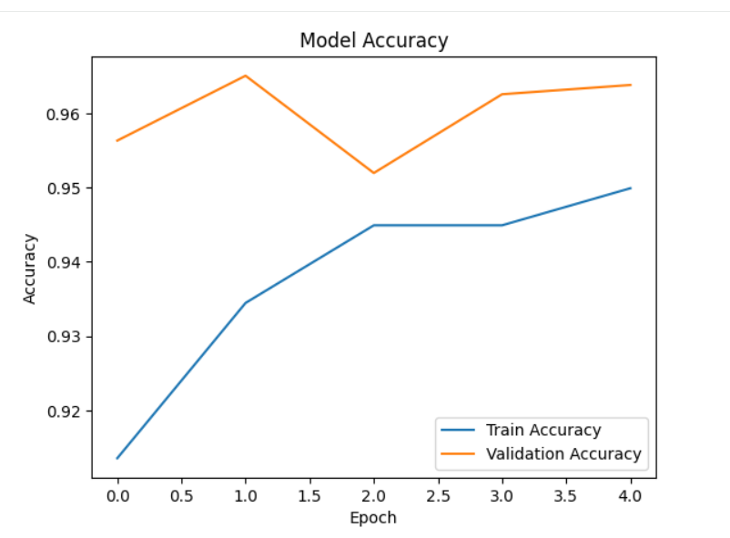
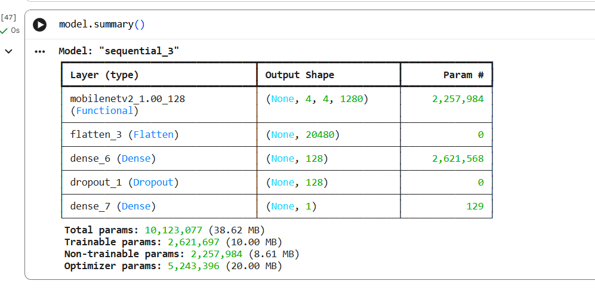

# Cats vs Dogs Image Classification

Built using CNN and Transfer Learning (MobileNetV2).

Achieved 96% validation accuracy.

Technologies:
- Python
- TensorFlow
- Keras
- OpenCV
Note: Trained model file not uploaded due to GitHub size limits. 
Model can be recreated by running the notebook.
## 📊 Model Accuracy Graph

---

## 🧠 Model Architecture Summary

